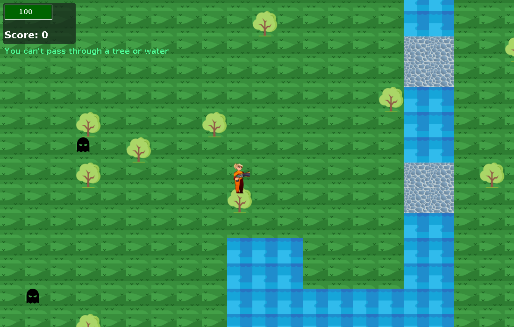

# PacMan — Java Swing game

A game I made while learning Java and GUI programming. Explore a grass-and-river map, collect rewards, and avoid ghosts. This update keeps the original game and five-class structure, with small bug fixes and a reproducible build.



## Controls

Use the **arrow keys** to move. Rewards increase your score and add another enemy. Ghosts patrol horizontally and chase when you get close. Contact reduces health. At game over, you can start again.

## Run on a Mac

Requires **Java 17 or newer**. The download includes `dist/PacMan.jar`.

1. Extract the ZIP.
2. Open Terminal, type `cd `, drag the extracted `PacMan_Forest` folder into Terminal, and press Return.
3. Run:

```sh
java -jar dist/PacMan.jar
```

`Start.command` runs the same command. You can double-click it if macOS permits it; if not, use Terminal as above.

## Work on the source

The original folders remain:

- `src/mainGame/Main.java` — starts the game.
- `src/mainGame/Frame.java` — creates the window.
- `src/mainGame/Panel.java` — map, input, rendering, score, health, and timer.
- `src/mainGame/Player.java` — player images, position, and movement.
- `src/mainGame/Enemies.java` — enemy positions, patrol, and chasing.
- `resourcesP/` — original images and animation.

Import `pom.xml` as a Maven project in your Java IDE, then run `mainGame.Main`. Or build with a JDK 17+:

```sh
sh build.sh
java -jar dist/PacMan.jar
```

Optional Maven build: `mvn package`, then `java -jar target/pacman-1.1.0.jar`. The shell build is the locally verified path.

## Small visual touch

A translucent backing behind the original health bar and score, plus a slightly smaller score font, makes the HUD easier to read. The original sprites and map are unchanged.

## Small fixes

- Start Swing on its event thread and close the application when its window closes.
- Fit the window to the desktop and keep keyboard controls working when the window is focused.
- Check map bounds before reading adjacent tiles; reject negative movement coordinates.
- Spawn rewards and ghosts on grass or bridges. Ghost patrols turn around at blocked tiles.
- Use the reward sprite's dimensions when detecting collection.
- Handle health reaching zero **or below**, and reset score, health, rewards, and enemies when replaying.
- Clamp the camera correctly, including when the window is larger than the map.
- Fix health-bar colors at exactly 50 or 15 health, use a standard font, and separate the score and warning text.
- Remove stale template comments and raw collection warnings.

No new game modes, sprites, map, movement system, or class hierarchy were added. `Player.java` is unchanged. `docs/changes.patch` shows the exact Java changes from the uploaded project.

## GitHub

The repository excludes compiled classes, crash dumps, macOS metadata, and local build output. GitHub Actions builds a downloadable JAR on pushes and pull requests. Keep your original ZIP separately as the original learning version.

Build and headless checks were completed; desktop interaction still needs a local play-through. The historical assets are included unchanged; document their authors and permissions if you plan to redistribute them publicly. No license has been chosen on your behalf.
